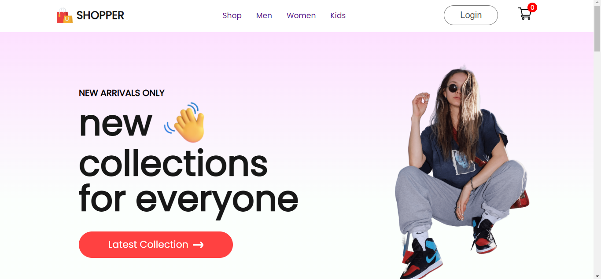

# E-Commerce Practice Project

This project is a practice e-commerce website built with React.js. It demonstrates basic e-commerce functionality, including product listings, product details.

## Features

- **Product Listings** displaying available items with prices and descriptions.
- **Product Detail Pages** with more information on each product.
- **Basic Styling** using CSS for layout and appearance.

## Technologies Used

- **React.js** - For building the user interface and managing component-based architecture.
- **CSS** - For styling the site layout and appearance.

